# 🍔 Anytime-Food End-to-End Analytics & AI Platform

An enterprise-grade data engineering and AI analytics platform for food delivery intelligence. Built with **Snowflake**, **dbt**, **Apache Airflow**, **Docker**, **Groq LPU**, and **Streamlit**.

---

## 🏛️ Architecture & Tech Stack

```mermaid
graph LR
    S3[Amazon S3 Raw Data] --> SF_RAW[Snowflake RAW]
    SF_RAW --> DBT[dbt Transformation]
    DBT --> STAGING[Staging Views]
    STAGING --> MARTS[Analytics Marts]
    MARTS --> AIRFLOW[Apache Airflow Orchestrator]
    AIRFLOW --> LLM[Groq LPU LLM Enrichment]
    LLM --> AI_SCHEMA[Snowflake AI Schema]
    AI_SCHEMA --> STREAMLIT[Streamlit Intelligence Studio]
```



- **Data Warehouse**: Snowflake (Medallion Architecture: `RAW`, `STAGING`, `MARTS`, `AI`)
- **Transformation**: dbt Core (`dbt-snowflake`)
- **Workflow Orchestration**: Apache Airflow in Docker (`airflow-apiserver`, `scheduler`, `dag-processor`)
- **AI & LLM**: Groq LPU (Llama 3), Sentence Transformers (RAG Embeddings)
- **Interactive UI**: Streamlit (Unified Executive Dashboard, Text-to-SQL Studio, RAG Review Chat)

---

## 📁 Repository Structure

```
├── ai/                     # Streamlit dashboards & AI agents
│   ├── dashboard.py        # Executive KPI & restaurant performance dashboard
│   ├── text_to_sql.py      # Natural language to Snowflake SQL assistant
│   ├── rag_chat.py         # Semantic search and RAG over customer reviews
│   └── enrich_reviews.py   # Batch LLM sentiment analysis & review enrichment
├── airflow/                # Airflow container setup & DAGs
│   ├── dags/               # Production ETL and AI enrichment pipelines
│   ├── docker-compose.yaml # Multi-container Airflow 3 orchestration
│   └── Dockerfile          # Custom Airflow image with dbt-snowflake & Groq
├── Anytime-Food/           # dbt project
│   ├── models/staging/     # Conformed staging views & data tests
│   ├── models/marts/       # Fact & dimensional tables (revenue, SLA, reviews)
│   ├── profiles.yml        # dbt connection profile configuration
│   └── dbt_project.yml     # dbt project definitions
└── snowflake/              # Setup DDL, storage integrations, and copy pipelines
    ├── 01_setup.sql
    ├── 02_storage_integration.sql
    ├── 03_stage_and_format.sql
    ├── 04_raw_table.sql
    └── 05_copy_into.sql
```

---

## 🚀 Getting Started

### 1. Prerequisites
- Python 3.11+
- Docker Desktop
- Snowflake account
- Groq API key

### 2. Environment Configuration
Create a `.env` file in the root or set environment variables:
```bash
SNOWFLAKE_ACCOUNT=your_account_identifier
SNOWFLAKE_USER=your_user
SNOWFLAKE_PASSWORD=your_password
SNOWFLAKE_WAREHOUSE=ANYTIME_FOOD_WH
SNOWFLAKE_DATABASE=ANYTIME_FOOD
SNOWFLAKE_SCHEMA=STAGING
SNOWFLAKE_ROLE=DBT_ROLE
GROQ_API_KEY=your_groq_api_key
```

### 3. Run dbt Transformations
```powershell
cd Anytime-Food
dbt build
dbt docs generate; dbt docs serve
```

### 4. Start Airflow Orchestration
```powershell
cd airflow
docker compose build
docker compose up -d
```
Access the Airflow UI at `http://localhost:8080` (Username: `admin`, Password: `admin`).

### 5. Launch Streamlit AI Apps
```powershell
cd ai
streamlit run dashboard.py    # Unified Executive Dashboard
streamlit run text_to_sql.py  # AI SQL Assistant
streamlit run rag_chat.py     # Customer Review RAG Chat
```

---

## 📄 License
This project is licensed under the Apache 2.0 License.
